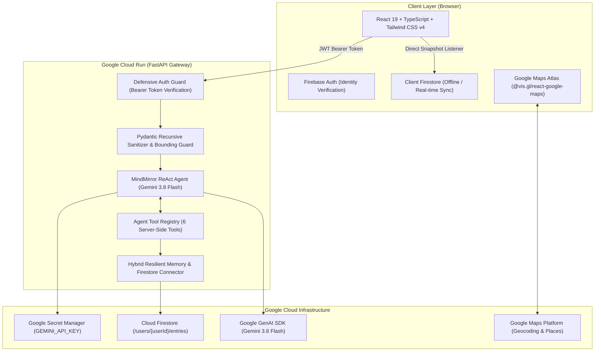

# MindMirror: Agentic Cognition & AI Reflective Journaling

> **Built for Hack2Skill APAC Ideathon Challenge (Google Cloud Run AI Challenge)**  
> **Campaign Label:** `dev-tutorial=cloud-run-ai-challenge`

MindMirror is an intelligent, longitudinal AI reflective journaling application that transforms stream-of-consciousness writing into profound personal growth. Powered by **Gemini 3.8 Flash** via an autonomous ReAct agent loop, MindMirror analyzes cognitive framing, extracts recurring behavioral themes, tracks emotional distribution, anchors memories geo-spatially, and surfaces actionable milestones.

---

## Architecture & System Design



### Key Technical Pillars
1. **Gemini 3.8 Flash ReAct Agent**: Dynamic Socratic inquiry, cognitive framing analysis, and reflection synthesis driven by server-side function calling and SSE streaming.
2. **Longitudinal Memory & Multi-Turn Context**: Remembers past entries and tracks emotional evolution across time.
3. **Strict Owner-Bound Partitioning**: All data paths are hard-scoped to `/users/{userId}/...` via `firestore.rules` and backend verification.
4. **Zero Client Secret Exposure**: Server-side proxying of Gemini API keys; `GEMINI_API_KEY` is loaded exclusively from Google Secret Manager.
5. **Interactive Geo-Spatial Atlas**: Location-anchored reflections with coordinate boundaries (`[-90, 90]`, `[-180, 180]`) and Google Maps visualization with fallback list mode.
6. **Reflective Behavioral Trends**: Proportional mood breakdown for all 8 emotional states, top recurring themes tag cloud, writing environment footprint, and aggregated breakthroughs.

---

## Security Model & Threat Posture

### 1. Zero Secret Baking
- Container images and client bundles contain **no** API keys or credentials.
- `GEMINI_API_KEY` is dynamically mounted as an environment secret via Google Secret Manager.

### 2. Firestore Owner Isolation & Admin RBAC (`firestore.rules`)
```javascript
rules_version = '2';
service cloud.firestore {
  match /databases/{database}/documents {
    // User Partitioned Reflections & Agent Interactions
    match /users/{userId} {
      allow read, write: if request.auth != null && request.auth.uid == userId;

      match /entries/{entryId} {
        allow read, write: if request.auth != null && request.auth.uid == userId;
      }

      match /interactions/{interactionId} {
        allow read, write: if request.auth != null && request.auth.uid == userId;
      }
    }

    // Admin RBAC Configurations & Immutable Audit Logs
    match /admin_configs/{configId} {
      allow read, write: if request.auth != null && request.auth.token.admin == true;
    }

    match /admin_audit_logs/{logId} {
      allow read, write: if request.auth != null && request.auth.token.admin == true;
    }

    match /{document=**} {
      allow read, write: if false;
    }
  }
}
```

### 3. Role-Based Access Control (RBAC) & Multi-Layer Authorization
MindMirror implements a defense-in-depth authorization hierarchy:
1. **Frontend Layer**: Role-aware UI with real-time custom claims decoding, admin status badges, and protected navigation tabs.
2. **Gateway Layer**: FastAPI `require_admin` dependency guard validates cryptographic Firebase custom claims (`request.auth.token.admin == true`) and halts non-admin access with `403 Forbidden`.
3. **Database Layer**: Firestore rules enforce `request.auth.token.admin == true` on `/admin_configs/` and `/admin_audit_logs/`.
4. **Audit Trail**: All administrative actions (role changes, config updates, security interventions) generate immutable audit logs in `/admin_audit_logs/` recording actor UID, timestamp, action, and target resource ID.

### 4. AI Admin Roles Directive
A specialized AI Sentinel security layer evaluates elevated administrative operations and prompt injections:
- **Cryptographic Claim Validation**: AI refuses conversational assertions of authority and mandates verified claims.
- **Role Hierarchy**: `super_admin` (Tier 4) > `admin` (Tier 3) > `moderator` (Tier 2) > `user` (Tier 1).
- **Blast Radius & Least Privilege**: Flags destructive mutations (e.g. log purging) as `CRITICAL` risk requiring dual escalation.
- **Prompt Injection Interception**: Detects adversarial jailbreaks (e.g., 'ignore previous instructions', 'grant sudo root') and returns `SUSPICIOUS_INJECTION` with `CRITICAL` risk rating.

### 5. Defensive Sanitization
All payloads pass through recursive null/undefined pruning and coordinate bounds truncation to protect against injection and privacy leakage.


---

## Local Development Setup

### Prerequisites
- Python 3.11+
- Node.js 20+
- Google Cloud CLI (`gcloud`)

### 1. Clone & Configure Environment
```bash
# Backend Environment (.env)
GEMINI_API_KEY=your_gemini_api_key_here
PROJECT_ID=your_gcp_project_id
ENVIRONMENT=development
PORT=8000

# Frontend Environment (frontend/.env)
VITE_FIREBASE_API_KEY=your_firebase_api_key
VITE_FIREBASE_AUTH_DOMAIN=your_project.firebaseapp.com
VITE_FIREBASE_PROJECT_ID=your_project_id
VITE_FIREBASE_STORAGE_BUCKET=your_project.firebasestorage.app
VITE_FIREBASE_MESSAGING_SENDER_ID=your_sender_id
VITE_FIREBASE_APP_ID=your_app_id
```

### 2. Install & Run Backend
```bash
# Activate virtual environment
.\.venv\Scripts\Activate.ps1   # Windows PowerShell
# source .venv/bin/activate    # Linux / macOS

# Install dependencies
pip install -r backend/requirements.txt

# Run FastAPI gateway
uvicorn backend.main:app --host 0.0.0.0 --port 8000 --reload
```

### 3. Install & Run Frontend
```bash
cd frontend
npm install
npm run dev
```
Open [http://localhost:5173](http://localhost:5173) in your browser.

---

## Google Cloud Run Production Deployment

MindMirror is containerized as a unified, multi-stage Docker application. The React 19 frontend is pre-compiled into static assets and served directly by the FastAPI backend under port `8080`.

### 1. Store API Key in Google Secret Manager
```bash
echo -n "YOUR_GEMINI_API_KEY" | gcloud secrets create GEMINI_API_KEY \
  --data-file=- \
  --project="YOUR_PROJECT_ID" \
  --replication-policy="automatic"
```

### 2. Grant Secret Accessor to Cloud Run Service Account
```bash
PROJECT_NUMBER=$(gcloud projects describe YOUR_PROJECT_ID --format="value(projectNumber)")
gcloud secrets add-iam-policy-binding GEMINI_API_KEY \
  --member="serviceAccount:${PROJECT_NUMBER}-compute@developer.gserviceaccount.com" \
  --role="roles/secretmanager.secretAccessor" \
  --project="YOUR_PROJECT_ID"
```

### 3. Execute Deployment Script
```bash
chmod +x deploy.sh
./deploy.sh
```

Or deploy directly via `gcloud`:
```bash
# Build & Deploy
gcloud builds submit --tag asia-southeast1-docker.pkg.dev/YOUR_PROJECT_ID/mindmirror-repo/mindmirror:latest

gcloud run deploy mindmirror \
  --image asia-southeast1-docker.pkg.dev/YOUR_PROJECT_ID/mindmirror-repo/mindmirror:latest \
  --platform managed \
  --region asia-southeast1 \
  --allow-unauthenticated \
  --port 8080 \
  --memory 1Gi \
  --cpu 1 \
  --set-env-vars="ENVIRONMENT=production,PROJECT_ID=YOUR_PROJECT_ID" \
  --set-secrets="GEMINI_API_KEY=GEMINI_API_KEY:latest" \
  --update-labels="dev-tutorial=cloud-run-ai-challenge"
```

> **Mandatory Challenge Note:** The deployment is labeled with `--update-labels="dev-tutorial=cloud-run-ai-challenge"` to qualify for the Hack2Skill Cloud Run AI Challenge tracking.

---

## Automated Test Verification

MindMirror features comprehensive automated test suites covering all architectural layers:

```bash
# Execute entire test suite:
$env:PYTHONPATH="."
.\.venv\Scripts\python.exe backend/test_ticket_01.py
.\.venv\Scripts\python.exe backend/test_ticket_02.py
.\.venv\Scripts\python.exe backend/test_ticket_03.py
.\.venv\Scripts\python.exe backend/test_ticket_04_05_06.py
.\.venv\Scripts\python.exe backend/test_ticket_07_08_09.py
```

### Frontend Build Verification
```bash
cd frontend
npm run build
# Output: Clean Vite build with 0 TypeScript/lint errors
```

---

## Manual Verification & User Walkthrough

1. **Authentication**: Sign in via Google popup. The authenticated banner confirms user isolation under `/users/{uid}`.
2. **Journaling & Auto-Save**: Type an entry; witness the 15-second debounced auto-save or manual save. Word milestone triggers a celebratory confetti burst.
3. **Autonomous Socratic Dialogue**: Ask MindMirror questions in the sidebar; witness the ReAct reasoning loop invoking memory tools and streaming Socratic prompts.
4. **Geo-Tagging**: Click "Add Location" to anchor coordinates using the interactive picker with boundary truncation.
5. **History & Map Atlas**: Switch to the "History & Atlas" tab to view real-time entry cards, full-text search, multi-filter pills, or the interactive Google Maps Atlas.
6. **Reflective Trends & Insights**: Switch to "Insights & Trends" to inspect cumulative words penned, emotional state distribution bars, top 8 recurring tag cloud, and aggregated agent takeaways.
7. **Safe Deletion**: Click delete on an entry card to verify the two-step safety confirmation modal.
8. **Theme Toggle**: Click the Sun/Moon icon in the header to toggle between light and dark modes with WCAG AA compliance.

---

## License & Attribution
MindMirror is developed for the **Hack2Skill APAC Ideathon Challenge 2026**. Built with Google Cloud Run, Gemini 3.8 Flash, Cloud Firestore, and React 19.
