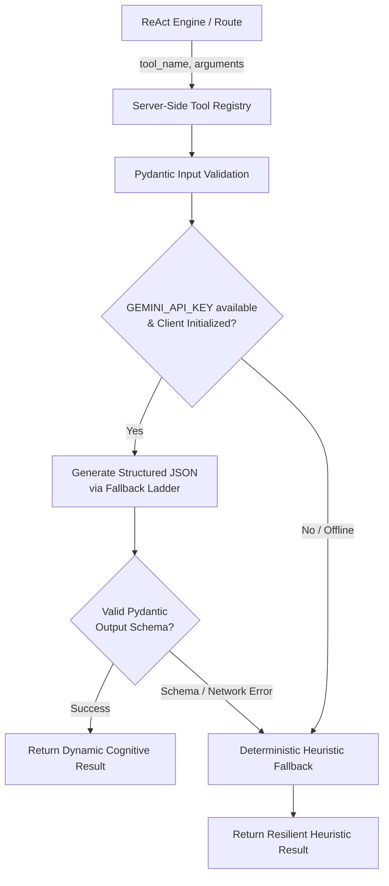

# ADR 001: Hybrid LLM Tool Execution with Deterministic Heuristic Fallback

- **Status**: Accepted
- **Deciders**: MindMirror Core Architecture Team
- **Date**: 2026-09-06
- **Context**: MindMirror Cognitive Agent (Gemini 3.8 Flash ReAct Engine)

---

## 1. Context and Problem Statement

MindMirror features a cognitive ReAct agent running on Google Cloud Run that leverages server-side tools to perform reflection analysis, memory search, milestone extraction, cognitive distortion identification, and inspirational prompt generation.

Previously, tool implementations were either static string returns or simple rule-based substring matching. While deterministic and fast, purely static/heuristic implementations suffer from:
1. Lack of cognitive depth and personalization (e.g., canned milestones that do not reflect what the user journaled about).
2. Limited distortion detection (only matching a few hardcoded keywords).
3. Generic reflection titles and summaries.

Conversely, making tools *exclusively* dependent on external LLM calls introduces risks:
1. Latency spikes and cost overhead.
2. Failure cascades during API rate limits (HTTP 429), quota exhaustion, or temporary upstream network disruption.
3. Degraded local development/testing experience when `GEMINI_API_KEY` is not present.

How should MindMirror's server-side tool execution pipeline be designed to deliver deep, nuanced cognitive analysis while maintaining high reliability and uninterrupted user experiences?

---

## 2. Decision Drivers

* **Cognitive Fidelity**: Journaling synthesis, cognitive distortion detection, and milestones must be tailored and context-aware.
* **Zero Downtime Resilience**: Journaling is an intimate, high-vulnerability activity; the agent must never throw uncaught API exceptions or leave the user with a broken experience.
* **Strict Type Safety & Schema Validation**: LLM outputs must strictly conform to known Pydantic schemas before consumption.
* **Developer Ergonomics**: The system must run smoothly in offline dev/test environments without requiring live cloud credentials.
* **Security & Privacy**: Zero client-side API key exposure; geo-coordinates must enforce 4-decimal privacy boundary (~11m resolution).

---

## 3. Considered Options

1. **Option A: Purely Deterministic / Static Tools** (Previous approach)
   - *Pros*: Zero latency/cost, 100% predictable, runs offline.
   - *Cons*: Repetitive, robotic, unable to grasp nuanced emotional nuances.
2. **Option B: Pure LLM Delegation**
   - *Pros*: Highly dynamic, context-aware.
   - *Cons*: Prone to failure on quota limits; cannot operate in offline dev modes; higher latency.
3. **Option C: Hybrid Two-Layer Execution (Chosen)**
   - Primary: Structured LLM call using official `google-genai` SDK with `response_mime_type="application/json"` and Pydantic validation via the 4-tier model fallback ladder (`gemini-3.8-flash` -> `gemini-3.1-flash-lite` -> `gemini-flash-latest` -> `gemini-3.7-flash`).
   - Secondary Fallback: Robust, deterministic heuristic implementation if the client is uninitialized, rate-limited, or all models in the ladder are exhausted.

---

## 4. Decision Outcome

We decided on **Option C: Hybrid Two-Layer Execution**.

### Architecture Overview

### Detailed Execution Contract

1. **Tool Invocation**: All tools receive `user_id` and strongly typed Pydantic parameters.
2. **LLM Execution Layer**:
   - Uses `gemini_manager.get_client()`.
   - Uses `response_mime_type="application/json"` for strict JSON generation.
   - Validates JSON output through dedicated Pydantic schemas.
   - Leverages `generate_content_with_fallback` across the model ladder.
3. **Deterministic Heuristic Layer**:
   - `tool_analyze_cognitive_framing`: Expanded pattern detection across Beck's cognitive distortions.
   - `tool_synthesize_entry`: Title extraction and multi-sentence contextual synthesis.
   - `tool_generate_actionable_milestones`: Context-sensitive rule parsing.
   - `tool_generate_inspirational_prompts`: Complete curated prompt matrix for all 8 emotional states (`Calm`, `Anxious`, `Grateful`, `Motivated`, `Sad`, `Angry`, `Overwhelmed`, `Hopeful`).
   - `tool_search_journal_memory`: Parameter-aware scoring with `tags` and `time_window` filtering (`recent`, `month`, `year`, `all`).
   - `tool_resolve_and_anchor_location`: 4-decimal truncation for geo-privacy.

---

## 5. Consequences

### Positive
- Users receive personalized, insightful reflection synthesis and actionable steps.
- The application remains fully functional even in complete isolation from the Gemini API or during quota spikes.
- Tests run deterministically without incurring API costs or requiring live keys.

### Negative / Trade-offs
- Two code paths per tool (LLM path + heuristic fallback) must be maintained and tested.
- Output schemas between LLM and fallback must stay strictly synchronized.
